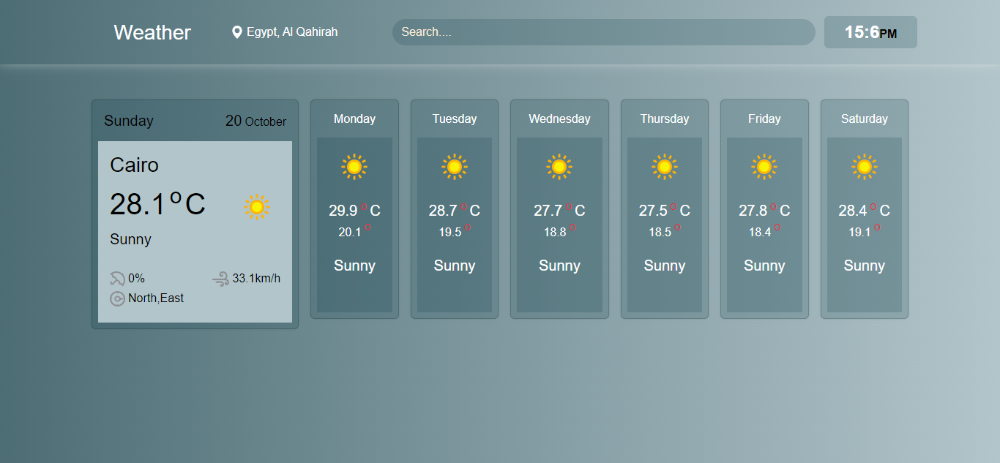

# WeatherApp


## Overview:
A responsive web application that allows users to check the current weather conditions of any city worldwide. The app fetches real-time weather data using an external API and displays key weather information such as temperature, humidity, and more.

## Table of Contents
- Features
- Live Demo
- Technologies Used
- Installation
- Usage
- API
- License
- Contact

  ## Features:
  - Search for the weather in any city.
  - Displays current weather conditions, including:
      - Temperature
      - Humidity
      - Wind speed
   - Responsive design that works on mobile, tablet, and desktop devices.
   - Interactive user interface for easy navigation.

## Live Demo:
You can view the live demo of the app here:
[WeatherApp](https://nourkuktut.github.io/WeatherApp/)

## Technologies Used
- HTML5 for the structure of the app.
- CSS3 for the styling and responsive design.
- JavaScript (ES6) for the dynamic functionality.
- Bootstrap for UI components and layout.
- Weather API to fetch real-time weather data.

## Installation

To run the project locally, follow these steps:

### Prerequisites
- Any modern web browser.

### Steps

1. Clone the repository:
   ```bash
   git clone https://github.com/nourkuktut/WeatherApp.git
2. Navigate to the project directory:
   ```bash
         cd WeatherApp
3. Open the index.html file in your browser or run a live server for development.

## Usage:
- Enter the name of the city in the search input.
- Click the "Search" button to retrieve the current weather.
- View detailed information about the weather of the specified city.

## API:
This project uses the [weatherapi](https://www.weatherapi.com/) API to fetch real-time weather data.
<br>
To use the API in your local environment, you need to:
1. Sign up at  [weatherapi](https://www.weatherapi.com/) and get your API key.
2.Replace the API key in the app.js file with your own key:
```bash
     const apiKey = 'YOUR_API_KEY';
```
### License:
- This project is licensed under the MIT License.
## Contact:
For inquiries about this project or similar development services, feel free to contact me:
<br>
**Linkedin: [here](https://www.linkedin.com/in/nourkutkut).**
<br>
**Email:nourkutkut12@gmail.com**


   

  
